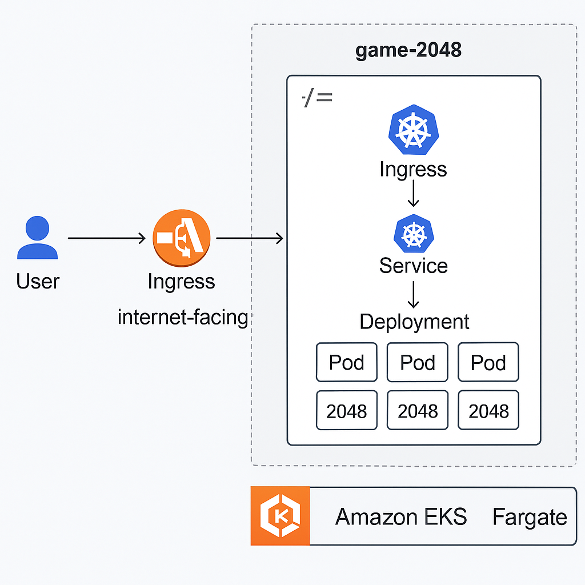

# AWS EKS App Deployment with Ingress Gateway and Load Balancing

## Introduction

This guide walks you through deploying applications on **Amazon Elastic Kubernetes Service (EKS)** and making them **securely accessible from the internet** using **Ingress controllers**. You'll go from setting up your AWS environment and Kubernetes cluster to building containerized applications, deploying them on EKS, and configuring Ingress to expose them to users.

Whether you're building internal APIs or public-facing services, understanding how to manage **Ingress resources** is essential for production-grade cloud-native infrastructure. This guide focuses on **Ingress setup using AWS Load Balancer Controller** and **best practices** for secure, scalable exposure of Kubernetes services.


---
## Architecture Diagram




---

## Table of Contents

1. [Kubernetes Essentials](#kubernetes-essentials)  
   - 1.1 [EKS vs. DIY Kubernetes Clusters](#eks-vs-diy-kubernetes-clusters)

2. [Preparing Your AWS Environment](#preparing-your-aws-environment)  
   - 2.1 [Creating AWS Account & IAM Users](#creating-aws-account--iam-users)  
   - 2.2 [Installing and Configuring AWS CLI & kubectl](#installing-and-configuring-aws-cli--kubectl)  
   - 2.3 [Networking and Security Group Setup](#networking-and-security-group-setup)

3. [EKS Cluster Deployment](#eks-cluster-deployment)  
   - 3.1 [Creating Cluster Using AWS Console](#creating-cluster-using-aws-console)  
   - 3.2 [Creating Cluster Using AWS CLI](#creating-cluster-using-aws-cli)  
   - 3.3 [Cluster Authentication Process](#cluster-authentication-process)

4. [Deploying Apps to EKS](#deploying-apps-to-eks)  
   - 4.1 [Building Docker Images](#building-docker-images)  
   - 4.2 [Creating Kubernetes YAML Files](#creating-kubernetes-yaml-files)  
   - 4.3 [Step-by-Step Deployment to EKS](#step-by-step-deployment-to-eks)

---

## 1. Kubernetes Essentials

### 1.1 EKS vs. DIY Kubernetes Clusters

#### Managed EKS

**Advantages:**

- AWS handles all control plane operations like API server maintenance and upgrades.
- Seamless integration with IAM, CloudWatch, VPC, and other AWS services.
- Built-in scaling, monitoring, and compliance features.
- High availability and automated version updates.

**Drawbacks:**

- Comes with a higher cost compared to self-hosted options.
- Offers less flexibility and direct control over system internals.

#### Self-Hosted Kubernetes on EC2

**Advantages:**

- Lower operational cost using EC2 pricing models.
- Full access to configure and modify cluster infrastructure.
- Supports experimental Kubernetes versions before they're available on EKS.

**Drawbacks:**

- Requires manual setup, updates, and scaling efforts.
- Lacks built-in automation, increasing potential for misconfigurations.

---

## 2. Preparing Your AWS Environment

### 2.1 Creating AWS Account & IAM Users

- Sign up on [aws.amazon.com](https://aws.amazon.com/).
- Verify email, add billing information, and log in to the **AWS Console**.
- (Optional) Enable **Multi-Factor Authentication (MFA)** for added security.
- Create IAM users with console or programmatic access, and assign necessary permissions using groups or policies.
- Store generated access keys securely.

---

### 2.2 Installing and Configuring AWS CLI & kubectl

1. **Install AWS CLI**  
   - Download for your OS via [AWS CLI Quickstart Guide](https://docs.aws.amazon.com/cli/latest/userguide/cli-configure-quickstart.html)

2. **Configure AWS CLI**  
   Run the following and enter your IAM credentials:
   ```bash
   aws configure
   ```

3. **Install kubectl**  
   - Instructions for various platforms: [Install kubectl](https://kubernetes.io/docs/tasks/tools/install-kubectl/)

4. **Connect kubectl to EKS**  
   - Use this command to set up your kubeconfig:
   ```bash
   aws eks update-kubeconfig --name your-cluster-name
   ```

5. **Verify Setup**  
   ```bash
   kubectl get nodes
   ```

---

### 2.3 Networking and Security Group Setup

#### Create VPC & Subnets

- Use **Amazon VPC** to create a new Virtual Private Cloud.
- Set up public and private subnets across availability zones.

#### Configure Security Groups

1. **Create Security Group** under VPC
2. **Inbound Rules**: Allow ports such as SSH (22), or application ports
3. **Outbound Rules**: Default allow-all or restrict as needed
4. **Attach Security Group** to worker node EC2 instances

#### Set Up Internet Gateway

1. Create an **Internet Gateway** in the VPC service
2. Attach the gateway to your VPC
3. Update Route Tables to route internet-bound traffic (`0.0.0.0/0`) through the IGW

#### IAM Policy Setup

1. Create a **custom IAM policy** to allow required services (ECR, EC2, ELB, Auto Scaling)
2. Attach the policy to a new or existing IAM role
3. Use this IAM role when launching EKS worker nodes

---

## 3. EKS Cluster Deployment

### 3.1 Creating Cluster Using AWS Console

1. Go to the **Amazon EKS** dashboard.
2. Click on **“Create Cluster”** and fill out details like cluster name, role ARN, Kubernetes version, and VPC settings.
3. Wait for the control plane to become active.

### 3.2 Creating Cluster Using AWS CLI

Use this command to create a cluster:
```bash
eksctl create cluster \
  --name demo-cluster \
  --region your-region \
  --nodegroup-name demo-nodes \
  --node-type t3.medium \
  --nodes 2 \
  --nodes-min 1 \
  --nodes-max 3 \
  --managed
```

### 3.3 Cluster Authentication Process

- Ensure your kubeconfig file is updated (as shown in 2.2).
- Test access:
```bash
kubectl get svc
```

---

## 4. Deploying Apps to EKS

### 4.1 Building Docker Images

1. Write a **Dockerfile** for your app.
2. Build the image:
   ```bash
   docker build -t your-image-name .
   ```
3. Push to ECR or Docker Hub:
   ```bash
   docker tag your-image-name:latest <your-repo-uri>
   docker push <your-repo-uri>
   ```

---

### 4.2 Creating Kubernetes YAML Files

Prepare the following YAML manifests:

- **Deployment**: Define replicas, image, container ports
- **Service**: Expose your app using ClusterIP, NodePort, or LoadBalancer
- **ConfigMap/Secret** (optional): For environment configuration

Example `deployment.yaml`:
```yaml
apiVersion: apps/v1
kind: Deployment
metadata:
  name: my-app
spec:
  replicas: 2
  selector:
    matchLabels:
      app: my-app
  template:
    metadata:
      labels:
        app: my-app
    spec:
      containers:
      - name: my-app
        image: <your-image>
        ports:
        - containerPort: 3000
```

---

### 4.3 Step-by-Step Deployment to EKS

1. **Apply Deployment**:
   ```bash
   kubectl apply -f deployment.yaml
   ```

2. **Apply Service**:
   ```bash
   kubectl apply -f service.yaml
   ```

3. **Monitor**:
   ```bash
   kubectl get all
   ```

4. Access your app via the **LoadBalancer URL** (if used).

---

## Conclusion

This project is a complete end-to-end guide on deploying containerized applications with Kubernetes using **Amazon EKS**. From AWS setup to cluster provisioning and deploying real apps, it serves as a beginner-friendly yet production-ready reference.
